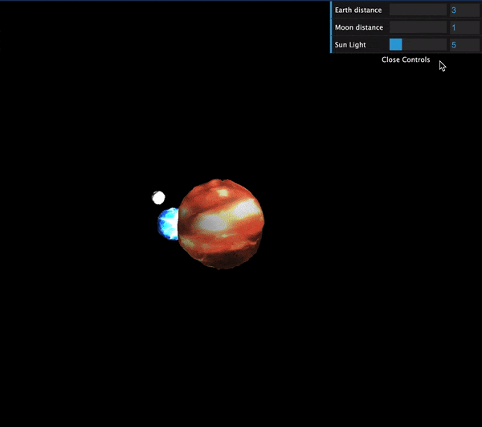

# Three.js Journey

## Setup

Download [Node.js](https://nodejs.org/en/download/).
Run this followed commands:

```bash
# Install dependencies (only the first time)
npm install

# Run the local server at localhost:8080
npm run dev

# Build for production in the dist/ directory
npm run build
```

## Session 02

This project is an oversimplified cubed solar system that includes the sun, earth, and moon.

I create this project based on session's 01 cubed version.

I change the `cubes` to `spheres`. I added texture to each sphere and some lights.
Also, I added a couple of params to the debug UI.

Here is the `TextureLoader`:

```javascript
const textureLoader = new THREE.TextureLoader();
const lavaColorTexture = textureLoader.load(
  "/textures/lava/Lava_002_COLOR.png"
);
const lavaNormalTexture = textureLoader.load("/textures/lava/Lava_002_NRM.png");
const lavaHeightTexture = textureLoader.load(
  "/textures/lava/Lava_002_DISP.png"
);
const lavaAOTexture = textureLoader.load("/textures/lava/Lava_002_OCC.png");
// const lavaSpecTexture = textureLoader.load("/textures/lava/Lava_002_SPEC.png");

const waterColorTexture = textureLoader.load(
  "/textures/water/Water_001_COLOR.jpg"
);
const waterNormalTexture = textureLoader.load(
  "/textures/water/Water_001_NORM.jpg"
);
const waterHeightTexture = textureLoader.load(
  "/textures/water/Water_001_DISP.png"
);
const waterAOTexture = textureLoader.load("/textures/water/Water_001_OCC.jpg");
// const waterSpecTexture = textureLoader.load(
//   "/textures/water/Water_001_SPEC.jpg"
// );

const rockColorTexture = textureLoader.load(
  "/textures/rock/Stylized_Rocks_002_basecolor.jpg"
);
const rockNormalTexture = textureLoader.load(
  "/textures/rock/Stylized_Rocks_002_normal.jpg"
);
const rockHeightTexture = textureLoader.load(
  "/textures/rock/Stylized_Rocks_002_height.png"
);
const rockAOTexture = textureLoader.load(
  "/textures/rock/Stylized_Rocks_002_ambientOcclusion.jpg"
);
const rockRoughnessTexture = textureLoader.load(
  "/textures/rock/Stylized_Rocks_002_roughness.jpg"
);
```

Each sphere is using `MeshStandardMaterial` with the available textures.

```javascript
const geometrySun = new THREE.SphereGeometry(1, 32, 32);
const materialSun = new THREE.MeshStandardMaterial({ map: lavaColorTexture });
materialSun.normalMap = lavaNormalTexture;
materialSun.aoMap = lavaAOTexture;
materialSun.displacementMap = lavaHeightTexture;
materialSun.displacementScale = 0.1;
// ...
const geometryEarth = new THREE.SphereGeometry(0.5, 32, 32);
const materialEarth = new THREE.MeshStandardMaterial({
  map: waterColorTexture,
});
materialEarth.normalMap = waterNormalTexture;
materialEarth.aoMap = waterAOTexture;
materialEarth.displacementMap = waterHeightTexture;
materialEarth.displacementScale = 0.05;
// ...
const geometryMoon = new THREE.SphereGeometry(0.2, 32, 32);
const materialMoon = new THREE.MeshStandardMaterial({ map: rockColorTexture });
materialMoon.normalMap = rockNormalTexture;
materialMoon.aoMap = rockAOTexture;
materialMoon.displacementMap = rockHeightTexture;
materialMoon.displacementScale = 0.05;
materialMoon.roughnessMap = rockRoughnessTexture;
```

I added the light we saw in the course `AmbientLight` and `PointLight`. To emulate the sun's light I added a second `PointLight` located in the center of the sphere.

```javascript
/**
 * Lights
 */

const ambientLight = new THREE.AmbientLight(0xffffff, 0.5);
scene.add(ambientLight);

const pointLight = new THREE.PointLight(0xffffff, 0.5);
pointLight.position.x = 2;
pointLight.position.y = 3;
pointLight.position.z = 4;
scene.add(pointLight);

const sunLight = new THREE.PointLight(0xffffff, light.sun);
scene.add(sunLight);
```

The debug UI includes

- Distance from the sun to the earth.
- Distance from the earth to the moon.
- Light emitted by the sun.

```javascript
/**
 * Debug
 */
const gui = new dat.GUI();

// Distances
const distances = {
  earth: 3,
  moon: 1,
};
const light = {
  sun: 5,
};
gui.add(distances, "earth").min(3).max(10).step(0.1).name("Earth distance");
gui.add(distances, "moon").min(1).max(5).step(0.1).name("Moon distance");
gui.add(light, "sun").min(1).max(20).step(0.1).name("Sun Light");
```


