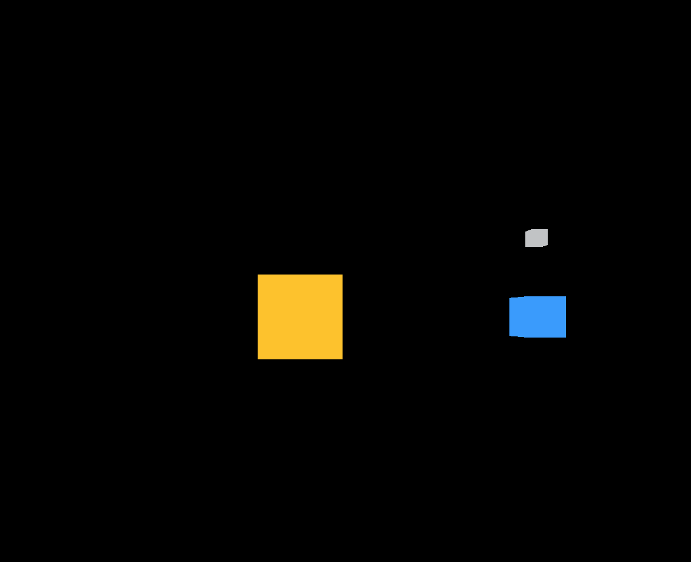
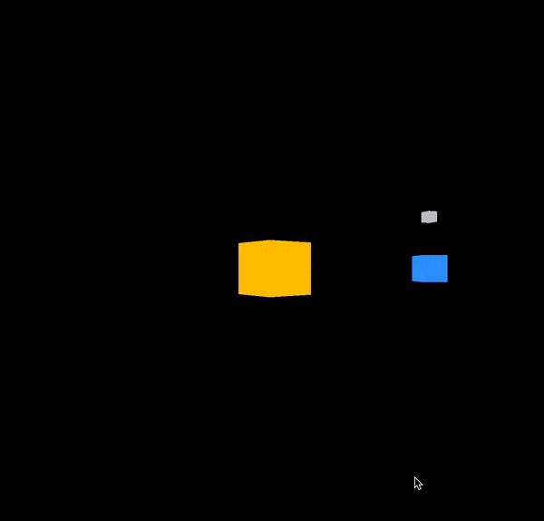
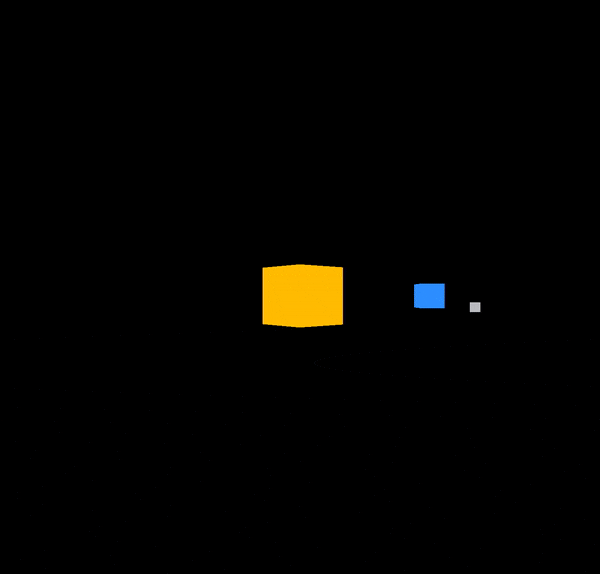

# Three.js Journey

## Setup
Download [Node.js](https://nodejs.org/en/download/).
Run this followed commands:

``` bash
# Install dependencies (only the first time)
npm install

# Run the local server at localhost:8080
npm run dev

# Build for production in the dist/ directory
npm run build
```
:notebook: Note: Use node v14.16.0 or latest

## Session 01

This project is an oversimplified cubed solar system that includes the sun, earth, and moon.

It includes the `OrbitControls` from lesson 7 and the fullscreen and resize from lession 8

```javascript
// Distances
const distances = {
    earth: 3,
    moon: 1
}

/**
 * Objects
 */
const geometrySun = new THREE.BoxGeometry(1, 1, 1);
const materialSun = new THREE.MeshBasicMaterial({ color: '#FFC300' });
const cubeSun = new THREE.Mesh(geometrySun, materialSun);
scene.add(cubeSun);

const geometryEarth = new THREE.BoxGeometry(0.5, 0.5, 0.5);
const materialEarth = new THREE.MeshBasicMaterial({ color: '#3399FF' });
const cubeEarth = new THREE.Mesh(geometryEarth, materialEarth);

const geometryMoon = new THREE.BoxGeometry(0.2, 0.2, 0.2);
const materialMoon = new THREE.MeshBasicMaterial({ color: '#C1C3C5' });
const cubeMoon = new THREE.Mesh(geometryMoon, materialMoon);
cubeMoon.position.y = distances.moon;

const earthGroup = new THREE.Group();
earthGroup.position.x = distances.earth;
earthGroup.add(cubeEarth);
earthGroup.add(cubeMoon);
scene.add(earthGroup);

```


## Animation

First we animate each cube rotation with a different speed.

```javascript
/**
 * Animate
 */
const clock = new THREE.Clock();

const tick = () => {
    const elapsedTime = clock.getElapsedTime();

    cubeSun.rotation.y = elapsedTime * Math.PI /4;
    cubeEarth.rotation.y = elapsedTime * Math.PI /6;
    cubeMoon.rotation.y = elapsedTime * Math.PI /8;

    // Update controls
    controls.update();

    // Render
    renderer.render(scene, camera);

    // Call tick again on the next frame
    window.requestAnimationFrame(tick);
}

tick();
```



Then we add a translation to the `earthGroup` and the cubeMoon object.

```javascript
    earthGroup.position.z = Math.sin(elapsedTime) * distances.earth;
    earthGroup.position.x = Math.cos(elapsedTime) * distances.earth;

    cubeMoon.position.y = Math.sin(elapsedTime / 2) * distances.moon;
    cubeMoon.position.x = Math.cos(elapsedTime / 2) * distances.moon;
```

